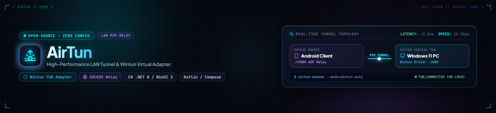
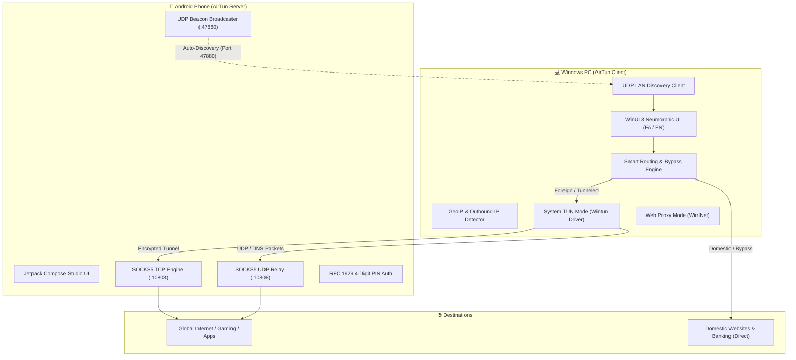

<div align="center">



# ⚡ AirTun
### Ultra-Fast, Low-Latency Mobile Internet &amp; Network Tunneling for Windows
**اشتراک‌گذاری پرسرعت، پایدار و بدون مرز اینترنت و ترافیک شبکه گوشی با ویندوز بر بستر LAN**

[](https://github.com/omid-io/AirTun/releases/latest)
[](#-tests--quality-assurance)
[](#)
[](LICENSE)
[](https://github.com/omid-io/AirTun)

<br/>


<br/>

[**English**](#-english) • [**فارسی**](#-فارسی)

<br/>

### 📥 Downloads (دانلود آخرین نسخه منتشرشده)

| Platform | Architecture | Package | Link |
| :--- | :--- | :--- | :---: |
| 💻 **Windows** | 64-bit (`x64` - Most PCs) | Setup Installer | [⬇️ **Download Installer (.exe)**](https://github.com/omid-io/AirTun/releases/latest/download/AirTun-v1.1.0-windows-x64-Setup.exe) |
| 💻 **Windows** | 32-bit (`x86` - Legacy) | Setup Installer | [⬇️ **Download Installer (.exe)**](https://github.com/omid-io/AirTun/releases/latest/download/AirTun-v1.1.0-windows-x86-Setup.exe) |
| 📱 **Android** | ARM64 (`v8a` - Modern Phones) | Signed APK | [⬇️ **Download APK**](https://github.com/omid-io/AirTun/releases/latest/download/AirTun-v1.1.0-arm64-v8a.apk) |
| 📱 **Android** | Universal (All Devices) | Signed APK | [⬇️ **Download APK**](https://github.com/omid-io/AirTun/releases/latest/download/AirTun-v1.1.0-universal.apk) |
| 📱 **Android** | ARMv7 (`32-bit` - Legacy) | Signed APK | [⬇️ **Download APK**](https://github.com/omid-io/AirTun/releases/latest/download/AirTun-v1.1.0-armeabi-v7a.apk) |
| 📦 **All Releases** | Multi-Platform | Checksums & Notes | [🏷️ **Release Notes (v1.1.0)**](https://github.com/omid-io/AirTun/releases/tag/v1.1.0) |

</div>

---

# 🌐 English

## 📖 Overview

**AirTun** is a modern, ultra-lightweight, zero-config solution designed to share your Android phone's internet and active VPN tunnel with Windows 10/11 computers over Wi-Fi or Hotspot with near-zero latency.

Unlike traditional mobile hotspots that get restricted or throttled by carriers and add heavy ping jitter to games, AirTun pairs a high-performance **native Kotlin SOCKS5 & UDP relay engine on Android** with a sleek **Neumorphic WinUI 3 desktop client for Windows**.

---

## ✨ Key Features

### 📱 Android Server Engine
- **Full TCP & UDP Relay:** High-throughput forwarding for DNS queries and real-time gaming/voice traffic.
- **Ultra-Low Memory Footprint:** Consumes under 15 MB RAM powered by non-blocking Kotlin Coroutines.
- **LAN Auto-Discovery (UDP Beacon):** Instantly announces presence across the local network/hotspot on port `47880`.
- **RFC 1929 4-Digit Security PIN:** Ephemeral cryptographic token pairing preventing unauthorized connections.
- **Unique Physical Device Counter:** Accurately tracks distinct connected computers rather than raw socket counts.
- **Studio Neumorphic UI:** Jetpack Compose dark studio aesthetics with real-time bandwidth metrics.

### 💻 Windows Desktop Client
- **Modern WinUI 3 & .NET 8 App:** Native Windows App SDK dark neumorphic styling with English (LTR) and Persian (RTL) support.
- **Dual Tunneling Modes:**
  - ⚡ **Full System TUN Mode:** High-speed Wintun virtual adapter routing 100% of Windows traffic (online gaming, CLI tools like `git`/`npm`/`docker`, Telegram, and all apps).
  - 🌐 **Web Proxy Mode:** Instant, lightweight WinINet system proxy configuration with transactional crash recovery.
- **🇮🇷 Smart Routing & Domestic Bypass:**
  - One-click `.ir` and local banking direct bypass — national services open directly without routing through the proxy or wasting data.
  - **Custom Rules Engine:** Add custom domain or IP wildcard rules (`*.example.com`) with instant filtering.
- **🌍 Real-Time GeoIP & Outbound Detector:** Live query of your external public IP, country flag, and ISP name.
- **📊 Real-Time Bandwidth Waveform:** Interactive graph showing upload/download throughput, peak speeds, and connection latency.
- **System Tray Support:** Background minimization and safe teardown on exit.

---

## 🏗️ Architecture



---

## 🚀 Quick Start Guide

### 1. Android Phone Setup:
1. Install `AirTun.apk` on your phone.
2. Enable Mobile Hotspot or connect to the same Wi-Fi network as your PC.
3. Open AirTun and tap the large **START** button. A 4-digit PIN will appear on screen.

### 2. Windows PC Setup:
1. Connect your PC to the phone's Hotspot / Wi-Fi.
2. Launch `AirTun.exe`.
3. Your phone will be detected automatically. Enter the 4-digit PIN and click **Connect to Phone**.

---

## 🧪 Tests & Quality Assurance

AirTun includes automated unit test suites for both client and server:

```bash
# Run Windows .NET 8 unit tests (36 passing tests)
dotnet test windows/AirTun.App.Tests/AirTun.App.Tests.csproj

# Build Windows Release
dotnet publish windows/AirTun.App/AirTun.App.csproj -c Release -p:Platform=x64 -o windows/publish/AirTun

# Run Android unit tests
cd android && ./gradlew testDebugUnitTest
```

---

# 🇮🇷 فارسی

## 📖 معرفی پروژه

**AirTun (ایر‌تون)** یک راهکار مدرن، سبک و با تاخیر نزدیک به صفر برای اشتراک‌گذاری اینترنت پرسرعت، ترافیک ضدتحریم و فورواردینگ پکت‌های شبکه میان گوشی‌های اندرویدی و سیستم‌های ویندوزی بر بستر شبکه محلی (LAN) است. برخلاف روش‌های سنتی هات‌اسپات که توسط اپراتورها مسدود می‌شوند یا پینگ بازی‌ها را به شدت افزایش می‌دهند، AirTun از **یک هسته بومی SOCKS5/UDP در اندروید** و **یک کلاینت قدرتمند با رابط کاربری WinUI 3 در ویندوز** استفاده می‌کند.

---

## ✨ ویژگی‌های برجسته

### 📱 هسته قدرتمند اندروید (Android Server)
- **پشتیبانی کامل از TCP و UDP:** فوروارد مستقیم بسته‌های DNS و پروتکل‌های بلادرنگ بازی و تماس صوتی.
- **مصرف بهینه منابع:** مصرف رم زیر ۱۵ مگابایت با معماری کاتلین کوروتینز.
- **کشف خودکار شبکه (UDP Beacon):** برادکست آنی در شبکه هات‌اسپات/وای‌فای روی پورت `47880`.
- **امنیت بر پایه پین‌کد ۴ رقمی:** رمزنگاری و احراز هویت موقت بر اساس استاندارد RFC 1929.
- **شمارش دقیق دستگاه‌های فیزیکی:** رهگیری آی‌پی‌های یکتای متصل به جای سوکت‌های خام.

### 💻 کلاینت مدرن ویندوز (Windows Desktop Client)
- **طراحی زیبا بر پایه WinUI 3 & .NET 8:** رابط کاربری مدرن نئومورفیک تیره، پشتیبانی ۱۰۰٪ از زبان‌های فارسی (RTL) و انگلیسی (LTR).
- **حالت‌های دوگانه اتصال:**
  - ⚡ **Full System TUN Mode:** ساخت اینترفیس مجازی WinTun جهت پوشش ۱۰۰٪ ترافیک کل ویندوز (بازی‌های آنلاین، تلگرام، ابزارهای برنامه‌نویسی `git`, `npm`, `pip`, `docker` و وب).
  - 🌐 **Fast Web Proxy Mode:** تنظیم آنی و سبک پروکسی سیستم برای مرورگرها همراه با بازیابی خودکار.
- **🇮🇷 کنترل هوشمند روتینگ (Smart Routing):** دایرکت خودکار سایت‌های بانکی و دامنه‌های `.ir` به همراه قابلیت تعریف قوانین سفارشی.
- **🌍 تشخیص خودکار آی‌پی و کشور خروجی (GeoIP):** استعلام لحظه‌ای آی‌پی، پرچم کشور و نام اپراتور اینترنت.
- **📊 مانیتورینگ زنده ترافیک و سرعت:** نمودار لایو سرعت آپلود/دانلود، حجم کل و پینگ.
- **سیستم تری (System Tray):** اجرای روان در پس‌زمینه.

---

## 🚀 راهنمای سریع راه‌اندازی

### ۱. اجرای نسخه اندروید:
1. فایل `AirTun.apk` را روی گوشی نصب کنید.
2. هات‌اسپات گوشی را روشن کنید (یا گوشی و کامپیوتر را به یک مودم وای‌فای وصل کنید).
3. برنامه AirTun را باز کرده و دکمه **START** را لمس کنید تا پین‌کد ۴ رقمی ظاهر شود.

### ۲. اجرای نسخه ویندوز:
1. کامپیوتر را به هات‌اسپات گوشی وصل کنید.
2. فایل `AirTun.exe` را اجرا کنید.
3. گوشی شما به صورت خودکار در لیست دستگاه‌ها ظاهر می‌شود. روی آن کلیک کنید، پین‌کد ۴ رقمی را وارد کرده و دکمه **اتصال (Connect)** را بزنید.

---

## 📂 ساختار ریپازیتوری (Repository Structure)

```
AirTun/
├── android/                   # اپلیکیشن و سرور اندروید (Kotlin + Compose + Gradle)
│   └── app/src/main/kotlin/io/airtun/app/
│       ├── socks5/            # موتور بومی SOCKS5 TCP & UDP Relay
│       ├── beacon/            # برودکستر UDP Beacon کشف خودکار
│       └── ui/                # رابط کاربری شیشه‌ای Compose
├── windows/                   # کلاینت ویندوز (C# .NET 8 + WinUI 3)
│   ├── AirTun.Core/           # کتابخانه شبکه، کشف، پین، روتینگ و GeoIP
│   │   ├── Routing/           # موتور روتینگ و قوانین دایرکت ایران
│   │   ├── Geo/               # سرویس استعلام آی‌پی و لوکیشن
│   │   ├── Proxy/             # موتور ترنزکشنال پروکسی ویندوز
│   │   └── Tunnel/            # اینترفیس کارت شبکه مجازی WinTun
│   ├── AirTun.App/            # اپلیکیشن مدرن WinUI 3
│   │   ├── Styles/Tokens.xaml # توکن‌های رنگی و استایل Liquid Glass
│   │   └── Strings.cs         # ترجمه‌های کامل فارسی و انگلیسی
│   └── AirTun.App.Tests/      # ۳۶ تست واحد xUnit
└── windows/publish/           # خروجی نهایی آماده اجرای ویندوز (Win-x64)
```

---

## 📄 لایسنس (License)

این پروژه تحت مجوز **MIT License** منتشر شده است.
گیت‌هاب رسمی: [https://github.com/omid-io/AirTun](https://github.com/omid-io/AirTun)
